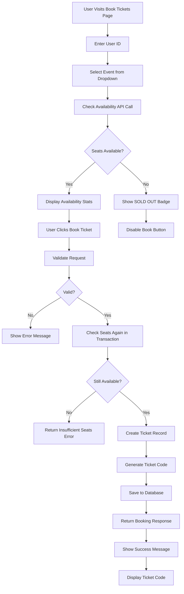
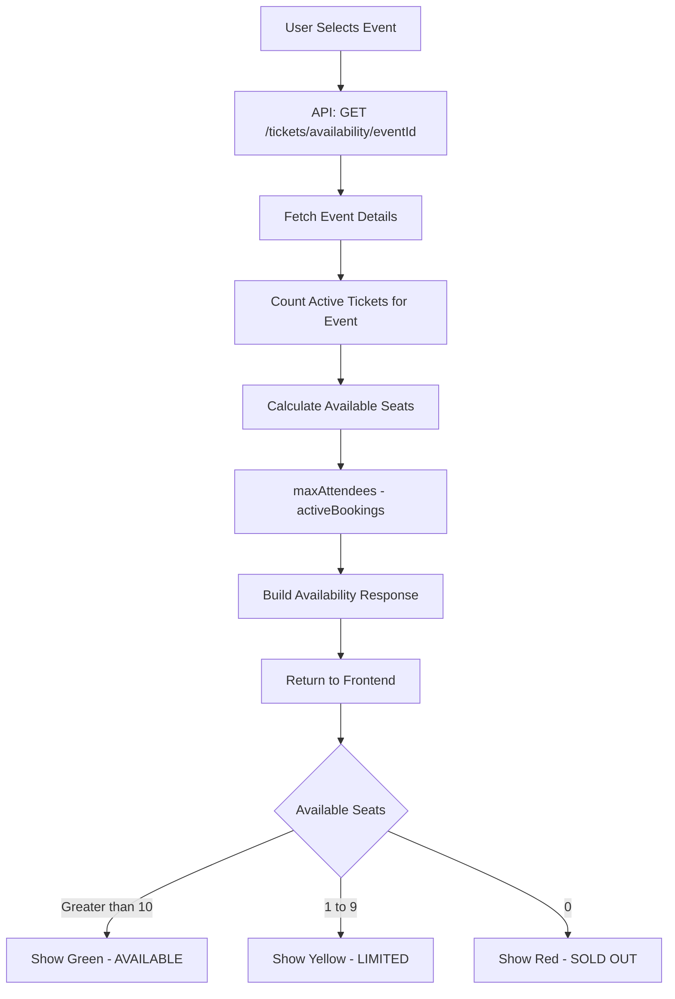
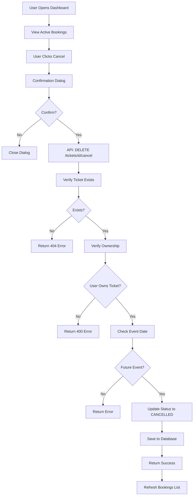
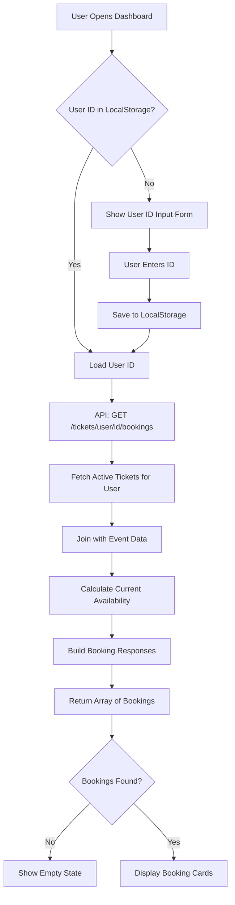
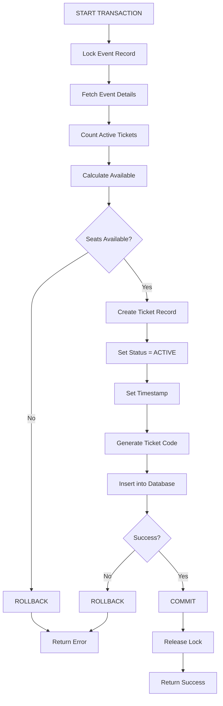
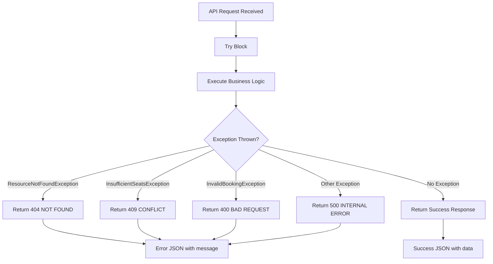
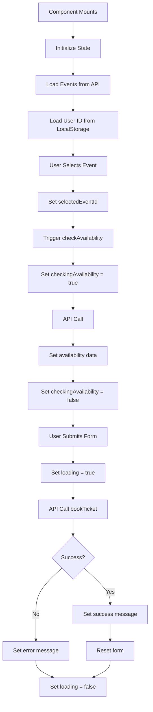
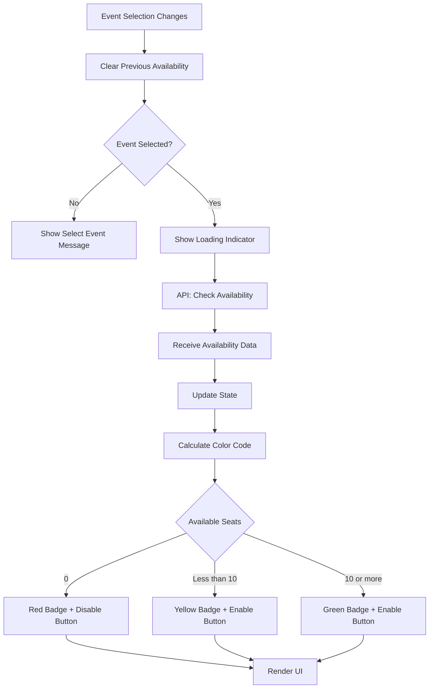
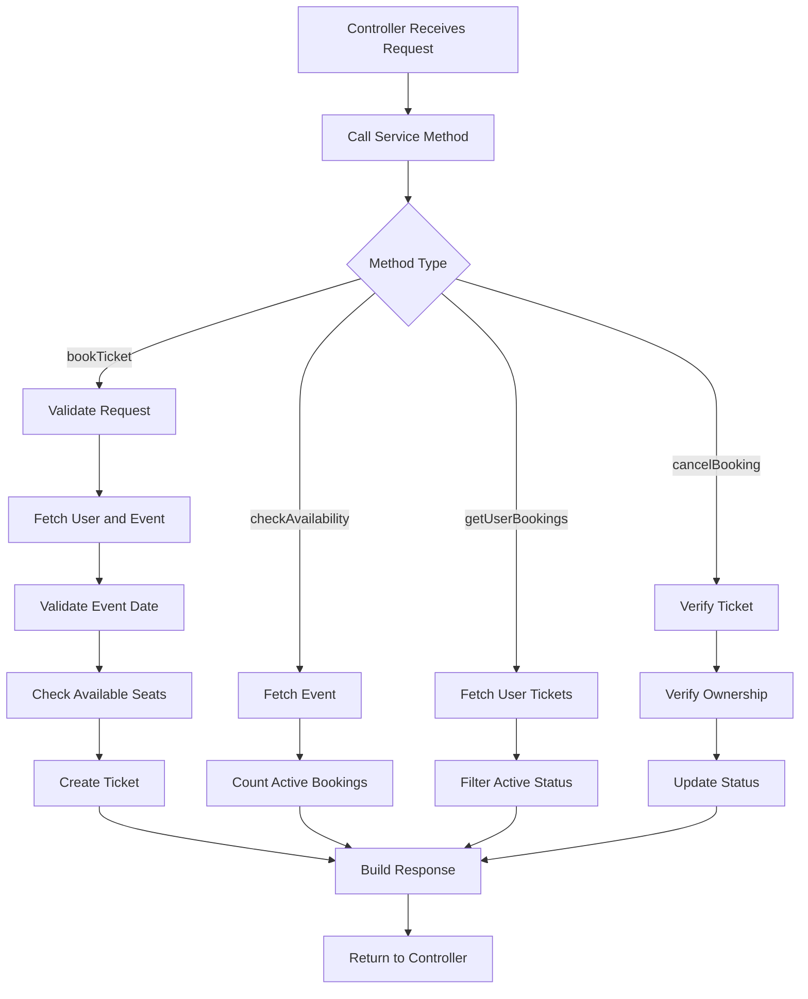
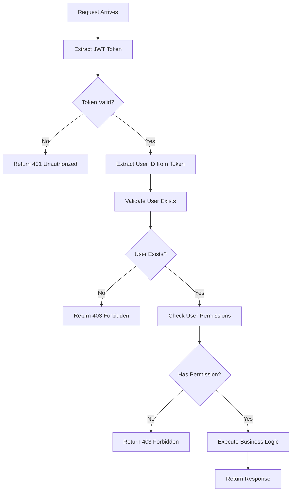

# Booking System Flow Diagrams

## 1. Ticket Booking Flow



## 2. Availability Check Flow



## 3. Booking Cancellation Flow



## 4. User Dashboard Load Flow



## 5. Database Transaction Flow (Booking)



## 6. API Error Handling Flow



## 7. Component State Management (TicketBooking)



## 8. Real-time Availability Update Flow



## 9. Backend Service Layer Flow



## 10. Security Validation Flow (Future Enhancement)



## Key Components Interaction

```
Frontend (React)                Backend (Spring Boot)              Database
┌──────────────────┐           ┌─────────────────────┐          ┌──────────┐
│  TicketBooking   │──────────>│  TicketController   │          │  tickets │
│   Component      │   HTTP    │                     │          │          │
└──────────────────┘           └──────────┬──────────┘          └────┬─────┘
                                          │                          │
┌──────────────────┐                      │                          │
│  UserDashboard   │                      │                          │
│   Component      │──────────>┌──────────▼──────────┐          ┌────▼─────┐
└──────────────────┘   HTTP    │   TicketService     │◄────────>│  events  │
                                │                     │   JPA    │          │
┌──────────────────┐            └──────────┬──────────┘          └────┬─────┘
│  ticketService   │                       │                          │
│      .js         │            ┌──────────▼──────────┐          ┌────▼─────┐
└──────────────────┘            │  TicketRepository   │◄────────>│  users   │
                                │                     │   SQL    │          │
                                └─────────────────────┘          └──────────┘
```

## State Transitions

### Ticket Status State Machine

```
    [Create Booking]
           │
           ▼
       ┌─────────┐
       │ ACTIVE  │
       └────┬────┘
            │
   [Cancel Booking]
            │
            ▼
      ┌───────────┐
      │ CANCELLED │
      └───────────┘
```

### Booking Lifecycle

```
1. User browses events
2. Checks availability (real-time)
3. Submits booking request
4. System validates and creates ticket
5. User receives ticket code
6. Ticket appears in dashboard
7. User can cancel if needed
8. Cancelled tickets free up seats
```

---

These diagrams illustrate the complete flow of the ticket booking system, showing how data moves between components and how different features interact with each other.
